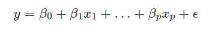
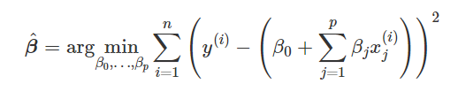
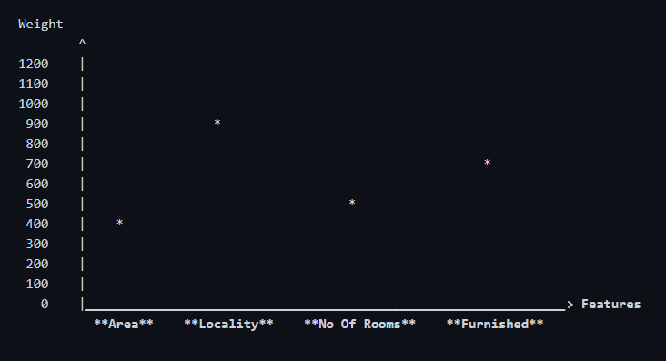

# 1. AIOps

>AIOps platforms utilize big data, modern machine learning and other advanced analytics technologies to directly and indirectly enhance IT operations (monitoring, automation and >service desk) functions with proactive, personal and dynamic insight. AIOps platforms enable the concurrent use of multiple data sources, data collection methods, analytical >real-time and deep) technologies, and presentation technologies.

## AIOps and DevOps
>To assist DevOps teams in handling routine IT tasks. By applying AI and machine learning algorithms to the monitoring data, AIOps can learn an environment’s behaviours and >generate alerts accordingly. Based on the anomalies detected, AIOps will be able to correlate important alerts from all sources into actionable, contextual insights, thus >enabling DevOps automation. A comprehensive AIOps solution will also be able to identify root causes and impacts, and prescribes potential solutions based on previous resolution >steps and feedback.

From my understanding it seems all connected and are seperated by a fine line . AIOps inclucates the basic principles of DevOps while it helps bring solution to the problems by automating most stuff of analyzing and enchancing performace by continuous evaluation of the system

## AIOps and MLOps
Even if both share this willingness to make our systems better and more efficient, the two fields overlap but do not meet under the same umbrella, neither in terms of the approach nor in terms of the raison d'être.

While MLOps' goal is bridging the gap between data scientists and operation teams, therefore between ML model building and their execution, AIOps focuses on automating incidents management and intelligent root cause analysis.

### *Conclusion*
Taking MLOps a step further , AIOps tend to automate systems by by collecting processing and observing intelligently the IT operations . AIOps have the capability to solve problems without human intervention , and is the future of IT Ops .

 
 
 
 

# 2. Interpretable Machine Learning

### *What is interpretation of a model?
>From my understanding when humans easily understand the decisions a machine learning model makes, we have an “interpretable model”. In short, we want to know what caused a >specific decision. If we can tell how a model came to a decision, then that model is interpretable.
>> As per my understanding , Linear regression models can be best interpreted by taking a look at their weights ( mostly because its the most important part of the model that governs what the model will predict )  
>>  
>> 

**Lets consider a cliche  example of predicting the price for houses in a location**
So we take an example of a house price prediction model , what can be possible features that we should consider or in simpler words what can be 'factors' that govern the price of a house - Locality ? Area ? Number of Rooms ? Furnished/Not Furnished ? Others ?
Well all these things might come into consideration , asuming that the evaluator of this answer (you reading this) already know what goes on behind the scenes of a linear regression , I'll take the liberty of directly coming to the point that all the above mentioned factors would have specific weights . Some feature might have a larger weight than another depends totally on the case that we are dealing with .

                        
                        
                        
                        

 Above graph ( made by me for explanatory purposes )shows a very important aspect which could help a normal person to interpret that what does a linear model do . The graph shows that how much the predicted price is depended on the features , like "Locality" has a weight of 900 implying that it contributes most to the price of a house , in simpler words a noob could figure out that better the locality more the price , but a smart guy would make out that if he/she decides to compromise with the locality but instead go for a larger area they could still fit the house in their budget . And that is what is the whole point of interpreting a model , making it easy to analyze 

### ** Conclusion **
This seems to be a very interesting topic , this is the first time i've heard of it but it surely would revolutionalize the field of Machine Learning by allowing researchers anc scientists to work together as its easy to understand how a model works . 

   Advantages 👍 : - The modeling of the predictions as a weighted sum makes it transparent how predictions are produced.
                   - Would help integrete people from various fields into ML
                  
   Disadvantages 👎 : -Linear regression models can only represent linear relationships, i.e. a weighted sum of the input features
                      -Linear models are also often not that good regarding predictive performance
                      
 
 
 
 

# Auto ML [Optional]
 > Its about automating the whole procedure of Machine Learning from taking a raw dataset to deploying a model on it . 
 > Since it contains a whole pipeline to deploy a ML model it must inculcate the MLOps techniques for overall better functioning , understandability and analysis of MlOps .

 ## Tools for Auto ML -
 
 + ### [AutoKeras](https://autokeras.com/?source=post_page---------------------------)

   `import autokeras as ak` 
   ` clf = ak.ImageClassifier() `
   ` clf.fit(x_train, y_train) `
   ` results = clf.predict(x_test)`   
  
 
 Auto-Keras provides functions to automatically search for architecture and hyperparameters of deep learning models. 

  
 
 + ### [Auto Sklearn](https://www.automl.org/automl/auto-sklearn/)
 
  
 ` import autosklearn.classification `
  
 ` cls = autosklearn.classification.AutoSklearnClassifier() `
  
 ` cls.fit(X_train, y_train) `
  
 ` predictions = cls.predict(X_test) `

 
 Auto-sklearn automatically searches for the right learning algorithm for a new machine learning dataset and optimizes its hyperparameters. 

   
  
 + ### [Auto Pytorch](https://www.automl.org/automl/autopytorch/)

 ` autoPyTorch = AutoNetClassification("tiny_cs", max_runtime=300, min_budget=30, max_budget=90)`
 ` autoPyTorch.fit(X_train, y_train, validation_split=0.3)`
 ` y_pred = autoPyTorch.predict(X_test)`
 ` print("Accuracy score", sklearn.metrics.accuracy_score(y_test, y_pred))`

 
 
Auto-PyTorch automates  right architecture and hyperparameter settings by using multi-fidelity optimization and Bayesian optimization (BOHB) to search for the best settings. 

  
 
 + ### [Auto Folio](url)
 
 
 AutoFolio uses algorithm configuration to optimize the performance of algorithm selection systems by determining the best selection approach and its hyperparameters.

  
 
