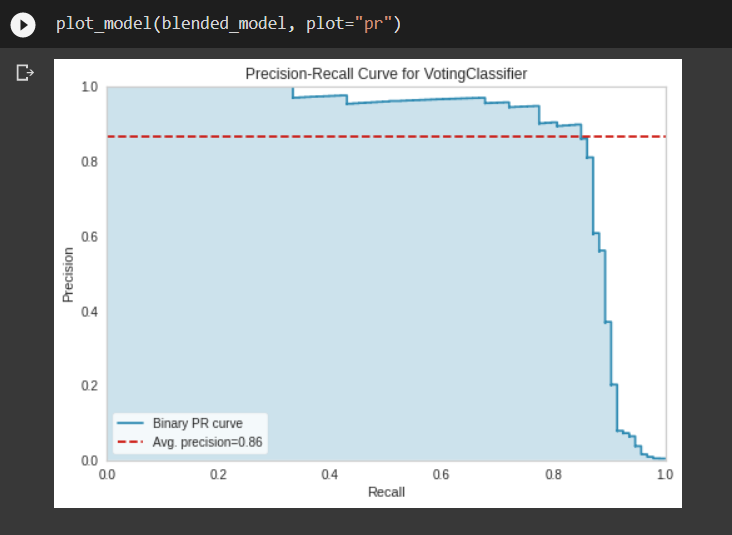
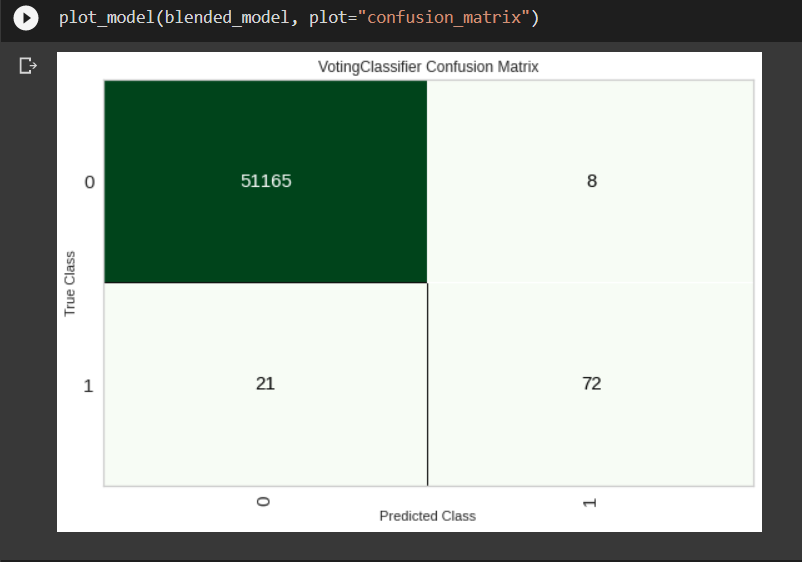

## Link to Repository
> [Click Here](https://github.com/abhinavr11/MLOps_Assignment/tree/pycaret_expt1)

### List of feature engineering and preprocessing
* Normalized the data
* Used minmax method of normalization (scales all the features and then brings it between 0-1)
* Removed 'Time' as a feature as it was irrelevant for regression task at hand
* Applied categorical imputations , This implicitly creates dummy features corresponding to the original categorical features in our dataset.
* Split the data into unseen and seen 
* Further split the data into test and training set (80:20)

Model                        | Before Tuning | After Tuning |
-----                        | ------------- | ------------ |
Extra Trees Classifier	     | 0.8466   | 0.7795              |
Random Forest Classifier     | 0.8443 	| 0.8623              |
K Neighbors Classifier       | 0.8357   | 0.8639              |
Linear Discriminant Analysis | 0.7939   | 0.7904              |
Decision Tree Classifier	   | 0.7299	  | 0.8187              |

## PLOTS ->
### Precision-Recall Plot

 
 
### Confusion Matrix

 
 

### Metrics
Accuracy -> 0.9993679997191109
Precision -> 0.8181818181818182
Recall -> 0.782608695652174
F! - Score -> 0.8
