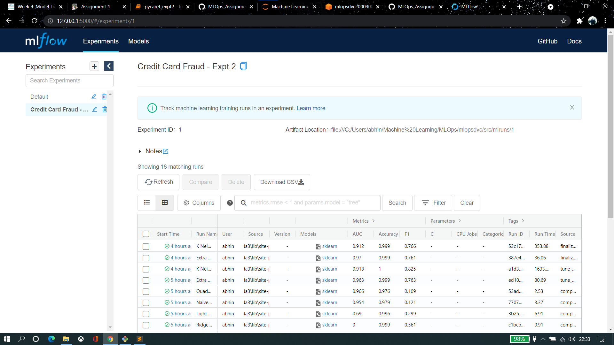

### Final Assignment

> [Link](https://github.com/abhinavr11/MLOps_Assignment/tree/pycaret_expt2)

1. Created ML pipeline of classifiers to detect credicard fraud by classifying 
2. Fine tuned the top 2 models(et,knn) based on F1 score
3. Deployed models on AWS S3 bucket and made it accessible locally by setting up env vars
4. Hosted the models locally and created an API endpoint using fastapi 
5. Tested both the models on unseen dataset to get predictions

